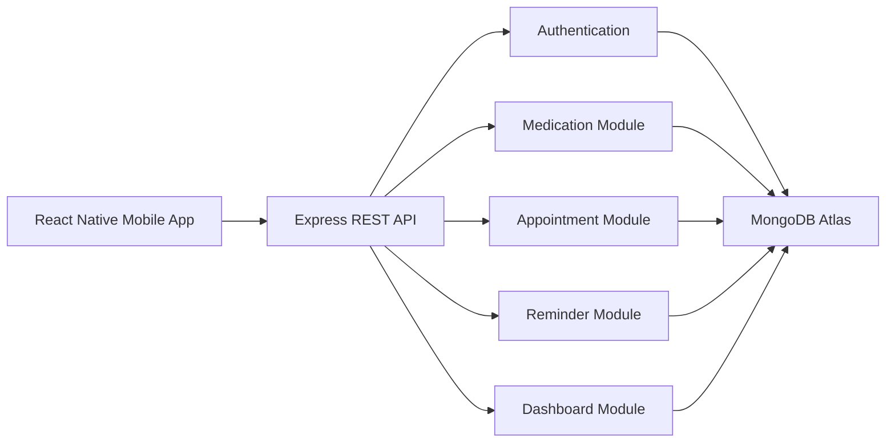
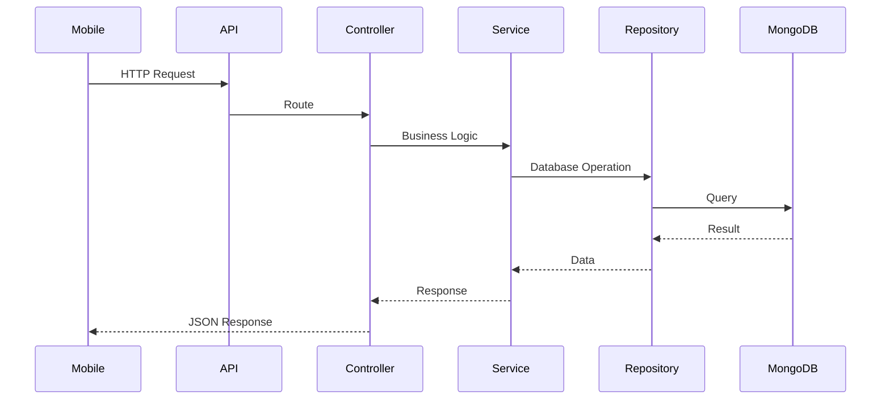

# 🩺 HealthNest Backend API


HealthNest is a Personal Health Companion designed to help users manage their daily health routines, medications, appointments, reminders, and health records from a single platform.

This repository contains the backend REST API powering the HealthNest mobile application.

---

---

# 🩺 HealthNest

### Personal Health Companion Backend API

> Helping users stay healthy through medication management, appointment scheduling, reminders, and personalized health tracking.

---

# 🚀 Features

## 🔐 Authentication

- User Registration
- Login
- JWT Authentication
- Protected Routes

---

## 💊 Medication Management

- Create Medication
- View Medications
- Update Medication
- Delete Medication

---

## 📅 Appointment Management

- Create Appointments
- View Appointments
- Update Appointments
- Delete Appointments

---

## ⏰ Reminder Management

- Medication Reminders
- Appointment Reminders
- Trigger Notifications
- Mark Medication as Taken

---

## 📊 Dashboard

- Summary Statistics
- Today's Reminders
- Upcoming Appointment
- Recent Activities
- Medication Adherence

---

# 🛠 Technology Stack

| Technology    | Purpose               |
| ------------- | --------------------- |
| Node.js       | Runtime Environment   |
| Express.js    | REST API Framework    |
| MongoDB Atlas | Database              |
| Mongoose      | ODM                   |
| JWT           | Authentication        |
| Joi           | Request Validation    |
| Bcrypt        | Password Hashing      |
| Winston       | Logging               |
| Morgan        | HTTP Logging          |
| Helmet        | Security Headers      |
| CORS          | Cross-Origin Requests |
| Compression   | Response Compression  |

---

# 📁 Project Structure

```text
src
│
├── common
│   ├── constants
│   ├── errors
│   ├── middlewares
│   ├── utils
│
├── config
│
├── database
│
├── docs
│
├── modules
│   ├── auth
│   ├── users
│   ├── medications
│   ├── appointments
│   ├── reminders
│   └── dashboard
│
├── routes
│
├── app.js
└── server.js
```

---

# 🏗 Architecture

HealthNest follows a layered architecture.

```text
Routes
    │
    ▼
Controllers
    │
    ▼
Services
    │
    ▼
Repositories
    │
    ▼
MongoDB Models
```

This separation of concerns improves maintainability, testing, and scalability.

---

# 🔐 Authentication

The API uses JSON Web Tokens (JWT).

Protected endpoints require:

```
Authorization: Bearer <access_token>
```

Passwords are securely hashed using Bcrypt before storage.

## 🏗 System Architecture



## 🔄 Request Lifecycle



## 🗄 Database Collections

| Collection   | Description             |
| ------------ | ----------------------- |
| Users        | Stores registered users |
| Medications  | Medication schedules    |
| Appointments | Medical appointments    |
| Reminders    | Notification reminders  |

## Responses

Success:

{
"success": true,
"message": "Medication created successfully.",
"data": {},
"errors": null,
"meta": null,
"timestamp": "2026-07-29T10:30:00.000Z"
}

Error:

{
"success": false,
"message": "Medication not found.",
"data": null,
"errors": {},
"meta": null,
"timestamp": "2026-07-29T10:30:00.000Z"
}

## 📐 API Design Principles

HealthNest follows RESTful API principles:

- Layered Architecture
- Separation of Concerns
- Repository Pattern
- JWT Authentication
- Standardized API Responses
- Consistent Error Handling
- Request Validation
- Pagination Support
- Resource Ownership Validation

---

# 📌 API Modules

## Authentication

| Method | Endpoint    |
| ------ | ----------- |
| POST   | /auth/login |
| GET    | /auth/me    |

---

## Users

| Method | Endpoint        |
| ------ | --------------- |
| POST   | /users/register |

---

## Medications

| Method | Endpoint         |
| ------ | ---------------- |
| POST   | /medications     |
| GET    | /medications     |
| GET    | /medications/:id |
| PATCH  | /medications/:id |
| DELETE | /medications/:id |

---

## Appointments

| Method | Endpoint          |
| ------ | ----------------- |
| POST   | /appointments     |
| GET    | /appointments     |
| GET    | /appointments/:id |
| PATCH  | /appointments/:id |
| DELETE | /appointments/:id |

---

## Reminders

| Method | Endpoint               |
| ------ | ---------------------- |
| POST   | /reminders             |
| GET    | /reminders             |
| GET    | /reminders/:id         |
| PATCH  | /reminders/:id         |
| DELETE | /reminders/:id         |
| POST   | /reminders/:id/trigger |
| PATCH  | /reminders/:id/taken   |

---

## Dashboard

| Method | Endpoint   |
| ------ | ---------- |
| GET    | /dashboard |

---

# ⚙ Environment Variables

Create a `.env` file.

```env
NODE_ENV=development

PORT=5000

MONGO_URI=<MongoDB Connection String>

JWT_SECRET=<JWT Secret>

JWT_EXPIRES_IN=1d

REFRESH_TOKEN_SECRET=<Refresh Secret>

REFRESH_TOKEN_EXPIRES_IN=7d

LOG_LEVEL=info
```

---

# ▶ Running the Project

Clone the repository

```bash
git clone https://github.com/<your-username>/HealthNest.git
```

Install dependencies

```bash
npm install
```

Run in development

```bash
npm run dev
```

Run in production

```bash
npm start
```

---

# 📖 API Documentation

Swagger/OpenAPI documentation is available at:

```
/api/docs
```

---

# 🌐 Deployment

Current deployment stack:

- Render
- MongoDB Atlas

---

# 🚧 Future Enhancements

- Caregiver Management
- Health Tracker
- Push Notification Integration
- AI Medication Assistant
- Health Reports
- Email Notifications
- SMS Notifications
- Wearable Device Integration

---

# 👨‍💻 Contributors

Backend Team

- Promise Okere

Frontend Team

- Capstone Frontend Team

---

# 📄 License

This project was developed as part of the Software Engineering Capstone Project.
